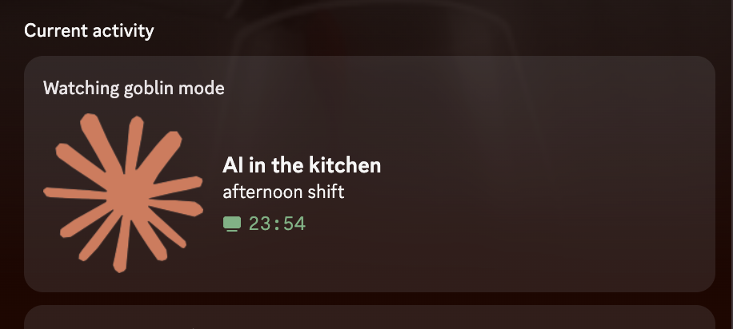

# goblin mode — Discord rich presence for AI coding

[](https://marketplace.visualstudio.com/items?itemName=leonardomjq.goblin-mode)
[](https://marketplace.visualstudio.com/items?itemName=leonardomjq.goblin-mode)
[](https://open-vsx.org/extension/leonardomjq/goblin-mode)
[](https://github.com/leonardomjq/agent-mode-discord/actions/workflows/ci.yml)
[](https://scorecard.dev/viewer/?uri=github.com/leonardomjq/agent-mode-discord)
[](LICENSE)
[](CHANGELOG.md)



> Built it the 47th time my Discord said I was "Away" while Claude Code was 30 minutes deep into a refactor.

Every existing Discord-VS Code extension watches your editor cursor. Useless during the long stretches where AI agents are doing the actual work and you're reading diffs. **goblin mode** watches the terminal + AI session files instead — Discord stays lit while **Claude Code** (or Cursor / Codex / Gemini / OpenCode) is shipping for you.

---

## What your Discord card looks like

While Claude is working in your terminal, your Discord shows:

- **Top line:** `Watching goblin mode` (activity-type lever — Discord's Watching prefix, not Playing)
- **State:** rotates between agent-specific (`claude is cooking`, `claude in the kitchen`) and generic (`AI is building`) variants
- **Detail:** time-of-day flips automatically (`morning service`, `afternoon shift`, `evening service`, `3am goblin shift`)
- **Timer:** ticks while the agent is working — clears when it stops

Lines rotate so friends DMing you see *something is happening* — not a stale away dot.

---

## How it knows the AI is working

Three detector tiers, lowest-cost first:

1. **Terminal process names** — regex match on the active terminal command (`^claude`, `^codex`, `^gemini`, `^opencode`)
2. **Claude Code session files** — fs.watch on `~/.claude/projects/*.jsonl` for live-session signal
3. **Optional companion lockfile** — for IDEs / tools that integrate via `~/.claude/agent-mode-discord.lock`

Multi-window leadership election (file-lock) so N open VS Code / Cursor windows = one Discord card. Failover under 5 seconds if the leader dies.

## Agent support — honest table

Detection is regex-based (`src/detectors/regex.ts`) — same mechanism for every built-in agent, plus opt-in custom patterns via `agentMode.detect.customPatterns`.

| Agent | Detection | Unit tests | Live-verified |
|---|---|---|---|
| Claude Code | `^claude` + `npx @anthropic-ai/claude-code` | 126 assertions | ✅ |
| Codex | `^codex` + `npx @openai/codex` | 10 assertions | ⚠️ regex only |
| Gemini | `^gemini` + `npx @google/gemini-cli` | 5 assertions | ⚠️ regex only |
| OpenCode | `^opencode` | 3 assertions | ⚠️ regex only |
| Cursor agent | terminal-name match | covered by shell-integration tests | ⚠️ regex only |
| Custom | your regex | n/a | bring your own |

If you use codex / gemini / opencode and detection misses, [file an issue](https://github.com/leonardomjq/agent-mode-discord/issues) with your terminal-process line — fixing a regex is a 5-minute PR.

---

## Install

### VS Code

Search **"goblin mode"** in the Extensions sidebar (`Cmd+Shift+X` / `Ctrl+Shift+X`), or:

```
ext install leonardomjq.goblin-mode
```

### Cursor / VSCodium / Windsurf

Same — search **"goblin mode"** in Extensions. Pulls from OpenVSX automatically.

### Companion plugin (optional, recommended)

Highest-fidelity AI detection. From this repo's root, in any shell:

```sh
claude plugin install ./companion/claude-code-plugin
```

Or from inside a Claude Code session:

```
/plugin install ./companion/claude-code-plugin
```

Detail: [companion/claude-code-plugin/README.md](companion/claude-code-plugin/README.md).

---

## Privacy

- **Zero outbound HTTP.** Discord IPC only — local socket on macOS/Linux, named pipe on Windows. CI-verified by `scripts/check-no-network.mjs` on every build.
- **Hide what you don't want shared.** Per-field `show` / `hide` / `hash` controls for workspace name, filename, and git branch.
- **Silence specific repos, orgs, hosts, or paths.** Glob + regex ignore lists.
- **No analytics. No telemetry. No server.** Solo project, MIT licensed.

Anything Discord receives is forwarded by your local Discord client, not by this extension. That hop is governed by [Discord's privacy policy](https://discord.com/privacy).

---

## Configuration

Open Settings → search **Agent Mode**. Most-used knobs:

| Setting | Default | What it does |
|---|---|---|
| `agentMode.activityType` | `watching` | Discord card prefix. Switch to `playing` if your client doesn't render Watching. |
| `agentMode.idleBehavior` | `show` | When no AI is active — `show` rotation copy, or `clear` the card. |
| `agentMode.privacy.workspaceName` | `show` | `show` / `hide` / `hash` |
| `agentMode.privacy.filename` | `show` | `show` / `hide` |
| `agentMode.privacy.gitBranch` | `show` | `show` / `hide` |
| `agentMode.animations.enabled` | `true` | Frame-cycling rotation. |
| `agentMode.messages.customPackPath` | `""` | Path to your own JSON copy pack. |

Full setting reference lives in [`package.json`](package.json) under `contributes.configuration`.

---

## Troubleshooting

**Discord shows nothing**
1. Discord desktop is running (not the browser).
2. Discord Settings → Activity Privacy → "Display current activity as a status message" must be **ON**.
3. Enable `agentMode.debug.verbose` and check the **Agent Mode (Discord)** output channel.

**Card stuck on old copy after upgrade**
Cursor's extension cache survives `Reload Window`. Cmd+Q the app, reopen.

More edge cases: [docs/CURSOR-COMPAT.md](docs/CURSOR-COMPAT.md) · [docs/MULTI-WINDOW.md](docs/MULTI-WINDOW.md) · [Advanced section below](#advanced).

---

## Advanced

<details>
<summary><strong>How detection works (multi-tier pipeline)</strong></summary>

Highest-fidelity tier with an active signal wins.

| Tier | Method | Latency | When available |
|---|---|---|---|
| 1 | Companion plugin lockfile (`~/.claude/agent-mode-discord.lock`) | <100 ms | Companion plugin installed |
| 2 | Shell Integration API (`onDidStartTerminalShellExecution`) | <500 ms | VS Code 1.93+, shell integration enabled |
| 3 | Session-file watch (`~/.claude/projects/*.jsonl` mtime) | ~1 s | Claude Code project directory exists |
| 4 | Terminal output polling | ~2 s | Always available (fallback) |

</details>

<details>
<summary><strong>Goblin pack — actual lines that ship</strong></summary>

```
AGENT_ACTIVE — primary:   AI is cooking · AI in the kitchen · AI is locked in · AI is building
AGENT_ACTIVE — claude:    claude is cooking · claude in the kitchen · claude is locked in · claude is building
AGENT_ACTIVE — codex:     codex is cooking · codex in the kitchen · codex is locked in
CODING:                   claude awaiting input · claude is paused
IDLE:                     claude on standby · claude is resting
```

Time-of-day modifier (the second card line): `3am goblin shift` · `morning service` · `afternoon shift` · `evening service`.

Ship a custom pack: point `agentMode.messages.customPackPath` at your own JSON file.

</details>

<details>
<summary><strong>Custom Discord Client ID (bus factor)</strong></summary>

By default this extension talks to a Discord Application owned by me (Client ID `1493599126217297981`). If I lose access to that account, every install goes silent.

Insulate yourself in 2 minutes:

1. [Discord Developer Portal](https://discord.com/developers/applications) → **New Application**.
2. Copy the **Application ID**.
3. VS Code Settings → `agentMode.clientId` → paste.

Also lets you upload custom large/small assets (your own goblin art).

Env-var override for ad-hoc / CI use: `AGENT_MODE_CLIENT_ID=your-id-here code .`

</details>

<details>
<summary><strong>Comparison vs other Discord presence extensions</strong></summary>

| Feature | goblin mode | [vscord](https://marketplace.visualstudio.com/items?itemName=LeonardSSH.vscord) | [discord-vscode](https://marketplace.visualstudio.com/items?itemName=icrawl.discord-vscode) | [RikoAppDev](https://marketplace.visualstudio.com/items?itemName=RikoAppDev.ai-agent-activity) |
|---|---|---|---|---|
| Terminal AI agent detection | ✅ multi-tier | ✗ | ✗ | partial (proposed API) |
| Stable VS Code APIs only | ✅ | ✅ | ✅ | ✗ uses `(vscode as any).chat` |
| Claude Code companion | ✅ lockfile | ✗ | ✗ | ✗ |
| Multi-agent (claude / codex / gemini / opencode) | ✅ | ✗ | ✗ | partial |
| Watching activity type default | ✅ | ✗ | ✗ | ✗ |
| Bundle size | ~220 KB | ~2 MB | ~1 MB | ~500 KB |
| Privacy controls | show / hide / hash + ignore lists | limited | basic | none |
| Network requests | none (IPC only) | none | none | unknown |

</details>

<details>
<summary><strong>Edge-case troubleshooting (shells, OS specifics)</strong></summary>

- **Cursor on Windows:** Shell Integration is unreliable. Falls back to session-file watch automatically. For best results install the companion plugin.
- **fish shell:** Confirm VS Code's integration script is loaded — `string match -q "$TERM_PROGRAM" vscode` should match. If not, source the script in `config.fish`.
- **cmd.exe:** Shell Integration not supported. Use PowerShell or the companion plugin.
- **Flatpak Discord:** IPC socket may not be exposed across the sandbox. Use the `.deb` / `.tar.gz` Discord install, or:
  ```sh
  flatpak override --user --filesystem=xdg-run/discord-ipc-*
  ```

</details>

<details>
<summary><strong>Observability — what's externally visible (no telemetry shipped)</strong></summary>

This extension ships zero telemetry. What's visible elsewhere:

- **Discord Developer Portal** (private to the maintainer) shows DAU/MAU and activity counts for Client ID `1493599126217297981`. Use your own Client ID per "Custom Discord Client ID" above to opt out entirely.
- **VS Code Marketplace** and **OpenVSX** show public install counts on the listing pages.

</details>

---

## Contributing

Issues + PRs welcome. File an issue first for anything beyond a typo. All code must pass `pnpm test` and `pnpm typecheck`.

## License

[MIT](LICENSE) — 2026 Leonardo Jaques

If goblin mode keeps you out of the AFK pit during AI sessions, ⭐ the [repo](https://github.com/leonardomjq/agent-mode-discord).
